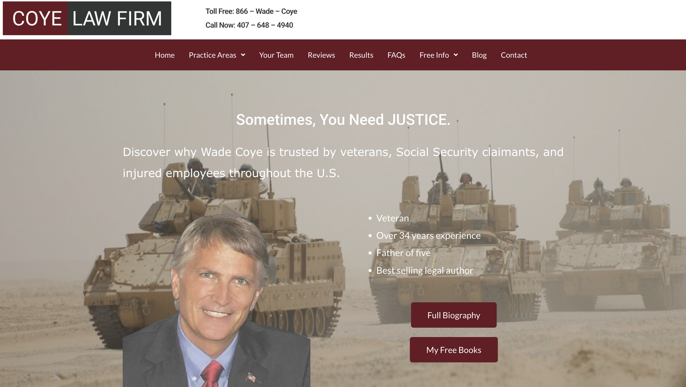

# ⚖️ Coye Law Firm - Landing Page Revamp

This project is a complete revamp of a law firm's landing page built using **React.js**, **Next.js**, **HTML5**, and **CSS3**. It was created as part of a frontend showcase to demonstrate UI/UX improvement, accessibility best practices, and responsive design implementation.

> 💼 A personal portfolio project crafted to highlight my frontend development capabilities during a technical interview process.

---

## 📸 Before & After Comparison

### 🔴 Original Design (Before)


### ✅ New Modern UI (After)


---

## 🚀 Features

- 🎨 **Revamped UI** with professional, clean design principles
- 📱 **Fully Responsive Layout** for mobile, tablet, and desktop
- ⚡ **Optimized Performance** using Next.js features
- 🧩 **Modular Component Design** with React
- 🔍 **SEO Enhancements** via structured metadata
- ♿ **Accessible Markup** using semantic HTML and ARIA attributes

---

## 🛠️ Tech Stack

- **React.js**
- **Next.js**
- **JavaScript (ES6+)**
- **HTML5 & CSS3**
- **Vercel** (for deployment)
- **Git** (version control)

---

## 📂 Project Structure

```bash
coye-law-firm-revamp/
├── app/
│   ├── components/
│   │   ├── Button/
│   │   ├── ConsultationChatBot/
│   │   ├── ContactForm/
│   │   ├── CTABanner/
│   │   ├── Header/
│   │   ├── Hero/
│   │   ├── ResultsHighlights/
│   │   └── Reviews/
│   ├── context/
│   ├── globals.css
│   ├── layout.js
│   └── page.js
├── public/
│   └── assets/
│       ├── before.png
│       └── after.png
├── README.md
└── package.json
```

---

## ⚙️ Running the Project Locally

# Clone the repository
git clone https://github.com/your-username/coye-law-firm-revamp.git

# Navigate into the project folder
cd coye-law-firm-revamp

# Install dependencies
npm install

# Run the development server
npm run dev

Visit http://localhost:3000 to view it locally.

---

## 🎯 Purpose

This project was built to:
- Exhibit my frontend development skills during a technical interview.
- Demonstrate a real-world revamp of an existing professional website.
- Show proficiency in modern frameworks, responsive design, and accessibility.

---

## 🔗 Live Preview

👉 View Live Site: https://your-vercel-link.vercel.app (yet to deploy)

---

## 📬 Contact

Name: Manasa Sai Karanam
Email: manasakaranam6199@gmail.com
LinkedIn: https://www.linkedin.com/in/manasa-sai-karanam/
Portfolio: https://manasa6sai.github.io/manasa-portfolio/

---

## 📄 License

This project is for learning and portfolio purposes only.
